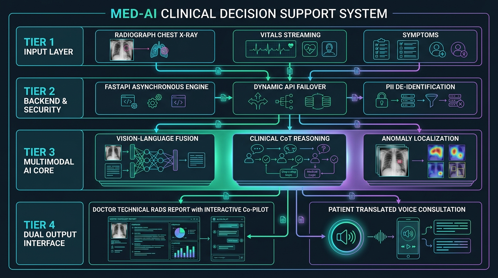

# Med-AI: Clinical Decision Support System (CDSS)

<div align="center">



### 🏥 *Industrial-Grade Multi-Modal AI Clinical Decision Support & Tele-Triage System*

[](https://fastapi.tiangolo.com/)
[](https://reactjs.org/)
[](https://aistudio.google.com/)
[](https://opensource.org/licenses/MIT)

**[🌐 Live Web Application](https://med-ai-clinical-decision-support-sy.vercel.app/)** • **[📑 API Documentation](http://127.0.0.1:8000/docs)** • **[👨‍💻 About the Developer](#-about-the-developer)**

</div>

---

An industrial-grade, full-stack Clinical Decision Support System (CDSS) designed to revolutionize radiologist workflows. By correlating multi-modal data points—including Chest X-rays, real-time vitals, and longitudinal patient history—Med-AI provides high-fidelity diagnostic suggestions with clinical precision in under 4 seconds.

---

## 🌟 Key Features

### 1. **Next-Gen Telemedicine: AI TeleConsult**
* **Virtual Physician Interface**: A high-end video consultation portal featuring real-time Picture-in-Picture (PiP) patient webcam integration.
* **AI Voice Synthesis**: Integrated speech synthesis & recognition engine that allows the AI to communicate with patients with empathetic, professional medical guidance in multiple regional languages.
* **Live Interactive Visualizers**: Dynamic audio equalizers and pulsing neural indicators that react in real-time as the AI communicates.
* **Encrypted Chat Logs**: Seamless hybrid interface combining video with a secure, real-time diagnostic transcript.

### 2. **Advanced Multimodal AI Intelligence**
* **Vision & Pathology Extraction**: High-accuracy detection of lung fractures, viral pneumonitis, cardiomegaly, effusions, and opacities via the Gemini-Vision pipeline in ~3–4 seconds.
* **Dual-Persona Reporting Engine**: Automatically branches diagnostic output into two distinct perspectives:
  * **Clinical (The Radiologist)**: High-level technical terminology, RADS/SOAP categorization, differential diagnosis, and recommended follow-ups.
  * **Patient (The Layman)**: Simplified, compassionate explanations with visual health badges and actionable recovery timelines.
* **Contextual Co-Pilot Chat**: Integrated interactive visual Q&A allowing radiologists to interrogate specific regions of interest (ROI) on radiographs.

### 3. **Clinical Safeguards & EHR Correlation**
* **Vitals Correlator**: Dynamically cross-references visual pathologies with patient vitals (Temperature, Blood Pressure, SpO2, Symptoms) to reduce false positives.
* **Sanity-Check Safeguards**: Automatically identifies medically abnormal inputs and flags critical monitoring errors or shock states.
* **Longitudinal Progression**: Natively detects returning patients and performs automated comparative analysis (*Improved vs. Worsened*) against previous scans.
* **High-Availability Key Failover**: Automated 3-tier API key rotation ensuring 99.9% uptime during emergency traffic surges.

### 4. **Hospital Operations Command Center**
* **Administrative Telemetry**: Real-time dashboard tracking scan volume, average token latency, and department workload distribution.
* **Critical Priority Inbox**: A dedicated high-risk triage feed that isolates life-threatening cases for immediate intervention.
* **Premium Design Aesthetic**: Fully responsive, glassmorphic UI featuring a custom **Global Preloader** and dynamic **Dark/Light Mode** tailored for low eye-strain clinical environments.

---

## 🏗️ System Architecture Flow

```
[ Tier 1: Multi-Modal Ingestion ]
  ├── High-Resolution Radiograph Upload (Chest X-Ray)
  ├── Real-time Vitals Streaming (SpO2, Pulse, Blood Pressure, Temperature)
  └── Clinical Symptoms & History Intake
            │
            ▼
[ Tier 2: Backend & Reliability Core ]
  ├── Asynchronous FastAPI High-Throughput Engine (<50ms baseline latency)
  ├── Automated Multi-Tier API Key Rotation & Failover System
  └── Client-Side PII De-identification (Patient Data Privacy)
            │
            ▼
[ Tier 3: Multimodal Diagnostic Engine ]
  ├── Image Normalization & Anomaly Localization (OpenCV / PIL)
  ├── Vision-Language Clinical Reasoning (Gemini Flash-Lite Architecture)
  └── Longitudinal EHR Historical Scan Correlation
            │
            ▼
[ Tier 4: Dual-Persona Output Layer ]
  ├── 👨‍⚕️ Clinician View: Technical RADS Findings + Differential Diagnoses + Visual Co-Pilot
  └── 🧑‍🤝‍🧑 Patient View: Simplified Vernacular Summaries + Web Speech Voice Consultation + PDF Export
```

---

## 🛠️ Tech Stack

| Layer | Technology |
|---|---|
| **Frontend** | React 18, Vite, Recharts, Lucide Icons, Glassmorphism CSS |
| **Backend** | Python 3.10+, FastAPI (Async), Uvicorn, Pydantic |
| **Database** | SQLite3 / Relational EHR Store (Longitudinal Scan Tracking) |
| **AI Models** | Google Gemini Flash-Lite (Vision & Clinical CoT Reasoning) |
| **Computer Vision** | OpenCV, Pillow (PIL) Image Preprocessing |
| **TeleHealth & Voice** | Web Speech API, Browser MediaDevices, html2pdf.js |
| **Styling** | Modern Vanilla CSS (Dark/Light Dynamic Mode) |

---

## 🚀 Getting Started

### 1. Prerequisites
* **Node.js** (v18+)
* **Python** (v3.10+)
* **Gemini API Key** (Free from [Google AI Studio](https://aistudio.google.com/))

### 2. Backend Installation
1. **Navigate & Install**:
   ```bash
   cd backend
   py -m pip install -r requirements.txt
   ```
2. **Configure Environment**:
   Create a `.env` file in the `backend/` directory:
   ```env
   GEMINI_API_KEY=YOUR_API_KEY_HERE
   GEMINI_API_KEY_2=YOUR_BACKUP_KEY_2 (Optional for automatic failover)
   GEMINI_API_KEY_3=YOUR_BACKUP_KEY_3 (Optional for automatic failover)
   ```
3. **Launch Server**:
   ```bash
   py -m uvicorn main:app --reload
   ```
   *Backend runs at: http://127.0.0.1:8000 (Swagger docs at `/docs`)*

### 3. Frontend Installation
1. **Navigate & Install**:
   ```bash
   cd frontend
   npm install
   ```
2. **Launch Dev Server**:
   ```bash
   npm run dev
   ```
   *Access the platform at: http://localhost:5173*

---

## 🛡️ Security & Compliance
* **Human-in-the-Loop**: Exclusive peer-review modules allow human radiologists to append override notes and sign off on AI suggestions, ensuring complete clinical accountability.
* **Multi-Tenancy**: Organization-based scoping ensures hospital data remains strictly siloed and secure.
* **Privacy by Design**: Sensitive patient identifiers are de-identified on the client before inference.
* **Lightweight Deployment**: Zero heavy GPU hardware required at local clinics—runs on standard PCs and tablets.

---

## 🧩 Troubleshooting

* **CORS Blocked**: If the frontend cannot reach the API, verify your IP is not being blocked and that `main.py` has the correct `allow_origins`.
* **Missing Analysis / 429 Quota**: Ensure your `GEMINI_API_KEY` is active. The system includes automatic multi-key rotation to bypass rate limits.
* **Database Reset**: If you need to re-seed demo patient history and scans, run `py seed_db.py` inside the `backend/` folder.

---

## 👨‍💻 About the Developer

**Utkarsh Srivastav**  
*Lead Developer & AI Researcher*

This system was architected and developed as a **Major Final Year Project**, driven by a passion for merging **Artificial Intelligence** with **Healthcare**. The vision behind Med-AI was to move beyond simple image classification and create a true **Clinical Decision Support System** that understands the nuances of patient history, vitals, and long-term health progression.

### 🎯 Core Engineering Contributions
* **AI Vision Engine**: Designing the Gemini-based multi-modal pathology correlation pipeline with sub-4s response time.
* **Telemedicine Innovation**: Building the **AI TeleConsult** module with live video processing and voice synthesis.
* **Backend Architecture**: Implementing the persistent EHR SQLite architecture, multi-tenancy, and automated 3-key failover system.
* **Frontend Design Excellence**: Crafting a premium, glassmorphic UI featuring a custom **Global Preloader** and dynamic **Theme Transitions**.
* **Medical Logic**: Developing the "Longitudinal Tracking" algorithm to simulate real-world radiological history comparison.

### 🌐 Connect & Collaborate
I am always open to discussing Medical AI, Full-Stack Engineering, or potential collaborations.

[](https://www.linkedin.com/in/utkarsh-srivastav-b433bb33a)
[](https://github.com/UtkarshSrivastav09)
[](mailto:utkarshsrivastav2206@gmail.com)

---
<div align="center">
  <b>Med-AI • Powering the Future of Digital Diagnostics</b>
</div>
